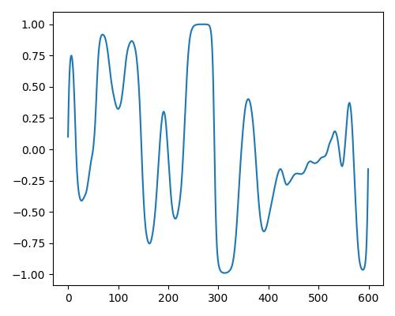

 

このWebサイトは、第136回音楽情報科学研究発表会 デモ・萌芽・議論セッションで発表の
“Wavetable合成の為のアトリビュート操作型CVAEエフェクターの検討”についての発表資料です。
(表題を再設定しました。)

## 目次

- [序論](#序論)
- [方法](#方法)
- [関連研究](#関連研究)
- [提案手法](#提案手法)
- [実験](#実験)
- [結果](#結果)
- [まとめ](#まとめ)

先に音を確認したい方はこちらから👉[examples](#examples)

## 概要

本研究では、ウェーブテーブル合成[^7]という音響合成方式において、**深層生成モデルを用いて意味的な音色制御を行う手法**を提案する。
ウェーブテーブル合成とは、1周期分の波形(以下、ウェーブテーブルと称する）を繰り返し読み出す事で音響合成を行う方式である。

[提案手法](#提案手法)では、Conditional Variational Autoencoder (CVAE) [^1]を用いて、ウェーブテーブルの条件付け生成を行う。
条件付けには、音響特徴に基づいて算出した明るさ(bright), 温かさ(warm), リッチさ(rich)という3つの意味的なラベルを用いる。
また、ウェーブテーブルの特徴を捉えるために、畳み込みとアップサンプリングを用いたCVAEのアーキテクチャを設計する。
これらは、リアルタイム性を高めるために推論時に周波数領域に変換せずに実行可能とする。

[実験](#実験)には、Adventure Kid Research & Technology [^2]が提供するモノラルのウェーブテーブル4158件をデータセットとして用いる。
実験の結果、提案手法は意味的なラベルを変化させることでウェーブテーブルの音色を操作できることを定性的・定量的に示す。
本研究は、データに基づいた**意味的なウェーブテーブル制御の実現による音色探索の直感性向上**を目的する。

## 序論

音楽制作やパフォーマンスにおいて、シンセサイザーは重要な役割を果たしている。
しかし、望む音色を生成するためには、知識と経験が必要である。
多くの音響合成方式が存在するが、ここではデジタル音響合成の最小単位である「ウェーブテーブル合成」に注目し、
データに基づいた意味的なウェーブテーブル制御を実現する。
この方法は、1周期分の波形を対象とする事で、ウェーブテーブル合成及び加算/減算合成,AM/FMなどの他合成方式にも適用できるものとする。

## 方法

### Wavetable Synthesis

  - デジタル音響合成の基礎となる技術
  - 1周期分の波形（ウェーブテーブル）を保存し繰り返し読み出す事で音を生成
  - 繰り返し速度を変える事で任意の音高を出力する

▶︎参考動画(クリックで開きます)

Wavetable Osillator basics
<iframe width="560" height="315" src="https://www.youtube.com/embed/k81hoZODOP0?start=17" title="YouTube video player" frameborder="0" allow="accelerometer; autoplay; clipboard-write; encrypted-media; gyroscope; picture-in-picture; web-share" allowfullscreen></iframe>

### CVAE(Conditional Variational Autoencoder)
  - Encoder-Decoderネットワークに基づいた、確率分布からサンプリングされた潜在変数を持つ生成モデルの一種
  - 入力データに対して条件付きで生成を行うことが可能

## 関連研究

- (WIP)

## 提案手法

### ①. データセット

  - Adventure Kid Research & Technology[^2]が提供しているモノラルのSingle Cycle Waveformを使用
  - データ長は600[sample]

### ②. 教師ラベルの算出
  - Wavetableの分析は、静的音色について表される音響特徴量を用いる必要がある
  - Kreković[^3]は、明るさ(bright), 暖かさ(warm), リッチさ(rich)の３種類の意味的なラベルをそれぞれ、スペクトル重心、スペクトル密度、奇数時倍音のエネルギー比から算出
  - 本研究でも同様の手法を使用しデータセットからラベルを抽出し学習と生成に用いる

静的音色:時間的な変化のない音(定常音)について、周波数スペクトルによって規定される音[^6]

### ③. モデル構成
  - 波形の時間依存性を捉えるために、 畳み込みとアップサンプリングを行うモデルを設計
  - 潜在変数の入力と出力部分で条件付けを実施

▶︎モデル構成詳細(クリックで開きます)

<iframe width="700" height="460" src="https://docs.google.com/spreadsheets/d/e/2PACX-1vRM3M1KsQHm4GjGpavyBKXJLGuvPehU3XL7BO_lcD08egtKUAwBQ44VqG8W0MD0jSnd8NHL1bckYlV5/pubhtml?gid=0&amp;single=true&amp;widget=true&amp;headers=false"></iframe>

### ④. 損失関数

  - 音響信号は位相が異なっていても同じスペクトルを得る事がある
  - 特徴を正確に捉える為にSTFT(Short Term Fourier Transform)を行い、スペクトルからロスを計算
  - スペクトルの分解能を上げる為に、6つ分のウェーブテーブルを連結し、下記のスペクトル距離を使用

 $$ S(x,y) =  \frac{||STFT(x) - STFT(y)||_F}{||STFT(x)||_F} + log(||STFT(x) -STFT(y)||_1) $$

   - $\|\|・\|\|_F$ , $\|\|・\|\|_1$ はそれぞれフロべニウスノルム、L1ノルムである
   - 上記スペクトル距離は、Engelら[^4]やCaillonら[^5]が使用しているマルチスペクトル距離を参考に設定

## 実験

### 実験目的
- 再構成誤差の最小化と条件付け精度と滑らかさを実現するモデルの検証
- 提案手法の有効性を定性的・定量的に確認

### 条件

- 学習率は0.001、Adam optimizerを使用
- バッチサイズは32
- エポック数は30000回

## 結果

### 再構成品質
  - 再構成品質と条件付け生成の結果を確認

<iframe width="900" height="680" src="https://docs.google.com/spreadsheets/d/e/2PACX-1vQwxpP2ApMAMufppn2ufYc12XJvryYNVus_J1emjjjvLfkYiltweHePaUqu0M44rmHgO4XBsx0-nhWz/pubhtml?widget=true&amp;headers=false"></iframe>

---

### examples

- **意味的なラベルによる合成の結果を以下に示す**
- 元になるWavetableをモデルに入力(入力Wavetableの詳細は[上記参照](#実験))
- 明るさ、リッチさ、暖かさをそれぞれ3段階の値(0,0.5,1.0)で条件付け生成し楽曲にて確認

**(折りたたみのタブになっているのでクリックするとサンプルが展開されます。)**

▶︎sine_wave

<table>
  <tr>
    <th>Condition value</th>
    <th>0</th>
    <th>0.5</th>
    <th>1.0</th>
  </tr>
  <tr>
    <td>明るさ(bright)</td>
    <td> <audio controls src="examples/sine_wave/sigmus_wavetablecvae sine_b0.wav" style="width:200px;height:30px;"></audio></td>
    <td><audio controls src="examples/sine_wave/sigmus_wavetablecvae sine_b0.5.wav" style="width:200px;height:30px;"></audio></td>
    <td><audio controls src="examples/sine_wave/sigmus_wavetablecvae sine_b1.0.wav" style="width:200px;height:30px;"></audio></td>
  </tr>
  <tr>
    <th>Estimate value</th>
    <th></th>
    <th></th>
    <th></th>
  </tr>
  <tr>
    <td>リッチさ(rich)</td>
    <td> <audio controls src="examples/sine_wave/sigmus_wavetablecvae sine_r0.wav" style="width:200px;height:30px;"></audio></td>
    <td><audio controls src="examples/sine_wave/sigmus_wavetablecvae sine_r0.5.wav" style="width:200px;height:30px;"></audio></td>
    <td><audio controls src="examples/sine_wave/sigmus_wavetablecvae sine_r1.0.wav" style="width:200px;height:30px;"></audio></td>
  </tr>
  <tr>
    <th>Estimate value</th>
    <th></th>
    <th></th>
    <th></th>
  </tr>
  <tr>
    <td>暖かさ(warm)</td>
    <td> <audio controls src="examples/sine_wave/sigmus_wavetablecvae sine_w0.wav" style="width:200px;height:30px;"></audio></td>
    <td><audio controls src="examples/sine_wave/sigmus_wavetablecvae sine_w0.5.wav" style="width:200px;height:30px;"></audio></td>
    <td><audio controls src="examples/sine_wave/sigmus_wavetablecvae sine_w1.0.wav" style="width:200px;height:30px;"></audio></td>
  </tr>
  <tr>
    <th>Estimate value</th>
    <th></th>
    <th></th>
    <th></th>
  </tr>
</table>
  

▶︎square_wave

<table>
  <tr>
    <th>Condition value</th>
    <th>0</th>
    <th>0.5</th>
    <th>1.0</th>
  </tr>
  <tr>
    <td>明るさ(bright)</td>
    <td> <audio controls src="examples/squ_wave/sigmus_wavetablecvae b0.wav" style="width:200px;height:30px;"></audio></td>
    <td><audio controls src="examples/squ_wave/sigmus_wavetablecvae b0.5.wav" style="width:200px;height:30px;"></audio></td>
    <td><audio controls src="examples/squ_wave/sigmus_wavetablecvae b1.0.wav" style="width:200px;height:30px;"></audio></td>
  </tr>
  <tr>
    <th>Estimate value</th>
    <th></th>
    <th></th>
    <th></th>
  </tr>
  <tr>
    <td>リッチさ(rich)</td>
    <td> <audio controls src="examples/squ_wave/sigmus_wavetablecvae r0.wav" style="width:200px;height:30px;"></audio></td>
    <td><audio controls src="examples/squ_wave/sigmus_wavetablecvae r0.5.wav" style="width:200px;height:30px;"></audio></td>
    <td><audio controls src="examples/squ_wave/sigmus_wavetablecvae r1.0.wav" style="width:200px;height:30px;"></audio></td>
  </tr>
  <tr>
    <th>Estimate value</th>
    <th></th>
    <th></th>
    <th></th>
  </tr>
  <tr>
    <td>暖かさ(warm)</td>
    <td> <audio controls src="examples/squ_wave/sigmus_wavetablecvae w0.wav" style="width:200px;height:30px;"></audio></td>
    <td><audio controls src="examples/squ_wave/sigmus_wavetablecvae w0.5.wav" style="width:200px;height:30px;"></audio></td>
    <td><audio controls src="examples/squ_wave/sigmus_wavetablecvae w1.0.wav" style="width:200px;height:30px;"></audio></td>
  </tr>
  <tr>
    <th>Estimate value</th>
    <th></th>
    <th></th>
    <th></th>
  </tr>
</table>

▶︎distorted_wave1

<table>
  <tr>
    <th>Condition value</th>
    <th>0</th>
    <th>0.5</th>
    <th>1.0</th>
  </tr>
  <tr>
    <td>明るさ(bright)</td>
    <td> <audio controls src="examples/distorted_wave/sigmus_wavetablecvae b0.wav" style="width:200px;height:30px;"></audio></td>
    <td><audio controls src="examples/distorted_wave/sigmus_wavetablecvae b0.5.wav" style="width:200px;height:30px;"></audio></td>
    <td><audio controls src="examples/distorted_wave/sigmus_wavetablecvae b1.0.wav" style="width:200px;height:30px;"></audio></td>
  </tr>
  <tr>
    <th>Estimate value</th>
    <th></th>
    <th></th>
    <th></th>
  </tr>
  <tr>
    <td>リッチさ(rich)</td>
    <td> <audio controls src="examples/distorted_wave/sigmus_wavetablecvae r0.wav" style="width:200px;height:30px;"></audio></td>
    <td><audio controls src="examples/distorted_wave/sigmus_wavetablecvae r0.5.wav" style="width:200px;height:30px;"></audio></td>
    <td><audio controls src="examples/distorted_wave/sigmus_wavetablecvae r1.0.wav" style="width:200px;height:30px;"></audio></td>
  </tr>
  <tr>
    <th>Estimate value</th>
    <th></th>
    <th></th>
    <th></th>
  </tr>
  <tr>
    <td>暖かさ(warm)</td>
    <td> <audio controls src="examples/distorted_wave/sigmus_wavetablecvae w0.wav" style="width:200px;height:30px;"></audio></td>
    <td><audio controls src="examples/distorted_wave/sigmus_wavetablecvae w0.5.wav" style="width:200px;height:30px;"></audio></td>
    <td><audio controls src="examples/distorted_wave/sigmus_wavetablecvae w1.0.wav" style="width:200px;height:30px;"></audio></td>
  </tr>
  <tr>
    <th>Estimate value</th>
    <th></th>
    <th></th>
    <th></th>
  </tr>
</table>
  

グラフは縦軸が振幅、横軸がデータ長です

## まとめ

### 考察・今後の展望

本研究では、ウェーブテーブル合成における意味的な音色制御を可能にする手法を提案し、
特に、ラベルを変化させることで、ウェーブテーブルの音色を操作することができることを示した。
ただし、再構成精度やラベルによる操作の滑らかさや効き具合には未だ課題が残っている。

また、提案手法では、音響特徴に基づいて算出した3つのラベルを用いた条件付け生成を行った。
しかし、ラベルの種類や数を増やすことで、より細かい音色の制御が可能となると考えられる。
今後は、より多様なラベルを用いた音色制御の実現を目指すことが重要である。

データセットとして、モノラルのウェーブテーブル4158件を使用したが、
データセットの増加によって、より多様な音色の生成や条件付けが可能となると考えられる。
今後は、より多様なウェーブテーブルを含むデータセットの構築が求められる。

また、生成された音色の評価指標として、
人間の主観的な評価や音響特徴を用いた客観的な評価が必要であり、
今後、検討を進める必要がある。

### UI案

▶︎おまけ：DAW上での使用イメージ(クリックで開きます)

## 謝辞
 This work was supported by Cybozu Labs youth.

## 参考文献

[^1]: Kingma, Durk P., et al. “Semi-supervised learning with deep generative models.” Advances in neural information processing systems 27 (2014).

[^2]: "Adventure Kid Research & Technology (AKRT)" https://www.adventurekid.se/akrt/

[^3]: Kreković, Gordan. "DEEP CONVOLUTIONAL OSCILLATOR: SYNTHESIZING WAVEFORMS FROM TIMBRAL DESCRIPTORS." Sound and Music Computing (2022).

[^4]: Engel, Jesse, et al. DDSP: Differentiable digital signal processing. In International Conference on Learning Representations, The International Conference on Learning Representations (2020)

[^5]: Caillon, Antoine, and Philippe Esling. "RAVE: A variational autoencoder for fast and high-quality neural audio synthesis." arXiv preprint arXiv:2111.05011 (2021).

[^6]: 岩宮眞一郎：音響サイエンスシリーズ1 音色の感性学， コロナ社，pp.64-67， 2010.

[^7]: Robert Bristow-Johnson, “Wavetable synthesis 101, a fundamental perspective,” in Audio Engineering Society Convention 101. Audio Engineering Society, (1996)
