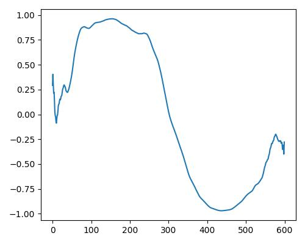

 

<!--このWebサイトは、第136回音楽情報科学研究発表会 デモ・萌芽・議論セッションで発表の
“Wavetable合成の為のアトリビュート操作型CVAEエフェクターの検討”についての発表資料です-->
## CVAEを用いたウェーブテーブル合成の意味的な音色制御についての検討: SEMANTIC CONTROL OF WAVETABLE SYNTHESIS USING CVAE

## 目次

- [序論](#序論)
- [方法](#方法)
- [提案手法](#提案手法)
- [実験](#実験)
- [まとめ](#まとめ)

## 概要

本研究では、ウェーブテーブル合成[^7]という音響合成方式において、深層生成モデルを用いて意味的な音色制御を行う手法を提案する。
ウェーブテーブル合成とは、1周期分の波形(以下、ウェーブテーブルと称する）を繰り返し読み出す事で音響合成を行う方式である。

[提案手法](#提案手法)では、Conditional Variational Autoencoder (CVAE) [^1]を用いて、ウェーブテーブルの条件付け生成を行う。
条件付けには、音響特徴に基づいて算出した明るさ(bright), 温かさ(warm), リッチさ(rich)という3つのラベルを用いる。
また、ウェーブテーブルの特徴を捉えるために、畳み込みとアップサンプリングを用いたCVAEのアーキテクチャを設計する。
これらは、リアルタイム性を高めるために推論時に周波数領域に変換せずに実行可能とする。

[実験](#実験)には、Adventure Kid Research & Tech-nology [^2]が提供するモノラルのウェーブテーブル4158件をデータセットとして用いる。
実験の結果、提案手法はアトリビュートラベルを変化させることでウェーブテーブルの音色を操作できることを定性的に示す。
本研究は、データに基づいた意味的な音色生成を実現することで、直感性及び簡易性を高める事を目標とする。

## 序論

### 背景・課題

  - シンセサイザーは音楽制作やパフォーマンスにおいて重要な役割を果たしている
    - しかし、思い描いた音色を生成するには知識と経験が必要
  - デジタル音響合成の最小単位である、"ウェーブテーブル合成"に着目
    - ウェーブテーブルは多くの場合、用意されたものを選ぶかスペクトラムから作成する[^7]
    - しかし、専門的な知識や経験が必要で習熟に時間を要す

### 目的

- **意味的なウェーブテーブル制御技術の実現による音色探索の直感性向上**
  - ＋α：新たなモジュレーション・エフェクトの創出とリアルタイムに使用可能な軽量モデルの構築

## 方法

### Wavetable Synthesis

  - デジタル音響合成の基礎となる技術
  - 1周期分の波形（ウェーブテーブル）を保存し繰り返し読み出す事で音を生成
  - 繰り返し速度を変える事で任意の音高を出力する

▶︎参考動画(クリックで開きます)

<iframe width="560" height="315" src="https://www.youtube.com/embed/k81hoZODOP0?start=17" title="YouTube video player" frameborder="0" allow="accelerometer; autoplay; clipboard-write; encrypted-media; gyroscope; picture-in-picture; web-share" allowfullscreen></iframe>

### CVAE(Conditional Variational Autoencoder)
  - Encoder-Decoderネットワークに基づいた、確率的生成モデルの一種
  - 入力データに対して条件付きで生成を行うことが可能

## 提案手法

### ①. データセット

  - Adventure Kid Research & Technology[^2]が提供しているモノラルのSingle Cycle Waveformを使用
  - データ長は600[sample]

### ②. 教師ラベルの算出
  - Wavetableの分析は、静的音色について表される音響特徴量を用いる必要がある
  - Kreković[^3]は、bright, warm, richの３種類のアトリビュートラベルを音響特長量から計算しており、同様の手法を使用しデータセットからラベルを抽出する
  - 上記のラベルをCVAEの学習と条件付け生成に用いる

静的音色:時間的な変化のない音(定常音)について、周波数スペクトルによって規定される音[^6]

### ③. モデル構成
  - 波形の時間依存性を捉えるために、 畳み込みとアップサンプリングを行うモデルを設計
  - 潜在変数の入力と出力部分で条件付けを実施

▶︎モデル構成詳細(クリックで開きます)

<iframe width="700" height="460" src="https://docs.google.com/spreadsheets/d/e/2PACX-1vRM3M1KsQHm4GjGpavyBKXJLGuvPehU3XL7BO_lcD08egtKUAwBQ44VqG8W0MD0jSnd8NHL1bckYlV5/pubhtml?gid=0&amp;single=true&amp;widget=true&amp;headers=false"></iframe>

### ④. 損失関数

  - 音響信号は位相が異なっていても同じスペクトルを得る事がある
  - 特徴を正確に捉える為にSTFT(Short Term Fourier Transform)を行い、スペクトルからロスを計算
  - スペクトルの分解能を上げる為に、6つ分のウェーブテーブルを連結し、下記のスペクトル距離を用いる

 $$ S(x,y) =  \frac{||STFT(x) - STFT(y)||_F}{||STFT(x)||_F} + log(||STFT(x) -STFT(y)||_1) $$

   - $\|\|・\|\|_F$ , $\|\|・\|\|_1$ はそれぞれフロべニウスノルム、L1ノルムである
   - 上記スペクトル距離は、Engelら[^4]やCaillonら[^5]が使用しているマルチスペクトル距離を参考にした

## 実験

### 実験目的
- 再構成誤差の最小化と条件付け精度と滑らかさを実現するモデルの検証
- 提案手法の有効性を定性的に確認

### 設定
- (WIP)

## 結果

### 再構成品質
  - 再構成品質と条件付け生成の結果を確認

<iframe width="900" height="680" src="https://docs.google.com/spreadsheets/d/e/2PACX-1vQwxpP2ApMAMufppn2ufYc12XJvryYNVus_J1emjjjvLfkYiltweHePaUqu0M44rmHgO4XBsx0-nhWz/pubhtml?widget=true&amp;headers=false"></iframe>

---

### 意味的なラベルによる音色の変化

- 元になるWavetableをモデルに入力(入力Wavetableの詳細は[上記参照](## 実験))
- 明るさ、リッチさ、暖かさをそれぞれ3段階の値(0,0.5,1.0)で条件付け生成し楽曲にて確認
- (折りたたみのタブになっているのでクリックすると展開されます。)

▶︎sine_wave

<table>
  <tr>
    <th>Condition value</th>
    <th>0</th>
    <th>0.5</th>
    <th>1.0</th>
  </tr>
  <tr>
    <td>明るさ(bright)</td>
    <td> <audio controls src="examples/sine_wave/sigmus_wavetablecvae sine_b0.wav" style="width:200px;height:30px;"></audio></td>
    <td><audio controls src="examples/sine_wave/sigmus_wavetablecvae sine_b0.5.wav" style="width:200px;height:30px;"></audio></td>
    <td><audio controls src="examples/sine_wave/sigmus_wavetablecvae sine_b1.0.wav" style="width:200px;height:30px;"></audio></td>
  </tr>
  <tr>
    <td>リッチさ(rich)</td>
    <td> <audio controls src="examples/sine_wave/sigmus_wavetablecvae sine_r0.wav" style="width:200px;height:30px;"></audio></td>
    <td><audio controls src="examples/sine_wave/sigmus_wavetablecvae sine_r0.5.wav" style="width:200px;height:30px;"></audio></td>
    <td><audio controls src="examples/sine_wave/sigmus_wavetablecvae sine_r1.0.wav" style="width:200px;height:30px;"></audio></td>
  </tr>
  <tr>
    <td>温かさ(warm)</td>
    <td> <audio controls src="examples/sine_wave/sigmus_wavetablecvae sine_w0.wav" style="width:200px;height:30px;"></audio></td>
    <td><audio controls src="examples/sine_wave/sigmus_wavetablecvae sine_w0.5.wav" style="width:200px;height:30px;"></audio></td>
    <td><audio controls src="examples/sine_wave/sigmus_wavetablecvae sine_w1.0.wav" style="width:200px;height:30px;"></audio></td>
  </tr>
</table>
  

▶︎square_wave

<table>
  <tr>
    <th>Condition value</th>
    <th>0</th>
    <th>0.5</th>
    <th>1.0</th>
  </tr>
  <tr>
    <td>明るさ(bright)</td>
    <td> <audio controls src="examples/sine_wave/sigmus_wavetablecvae sine_b0.wav" style="width:200px;height:30px;"></audio></td>
    <td><audio controls src="examples/sine_wave/sigmus_wavetablecvae sine_b0.5.wav" style="width:200px;height:30px;"></audio></td>
    <td><audio controls src="examples/sine_wave/sigmus_wavetablecvae sine_b1.0.wav" style="width:200px;height:30px;"></audio></td>
  </tr>
  <tr>
    <td>リッチさ(rich)</td>
    <td> <audio controls src="examples/sine_wave/sigmus_wavetablecvae sine_r0.wav" style="width:200px;height:30px;"></audio></td>
    <td><audio controls src="examples/sine_wave/sigmus_wavetablecvae sine_r0.5.wav" style="width:200px;height:30px;"></audio></td>
    <td><audio controls src="examples/sine_wave/sigmus_wavetablecvae sine_r1.0.wav" style="width:200px;height:30px;"></audio></td>
  </tr>
  <tr>
    <td>温かさ(warm)</td>
    <td> <audio controls src="examples/sine_wave/sigmus_wavetablecvae sine_w0.wav" style="width:200px;height:30px;"></audio></td>
    <td><audio controls src="examples/sine_wave/sigmus_wavetablecvae sine_w0.5.wav" style="width:200px;height:30px;"></audio></td>
    <td><audio controls src="examples/sine_wave/sigmus_wavetablecvae sine_w1.0.wav" style="width:200px;height:30px;"></audio></td>
  </tr>
</table>

▶︎distorted_wave1

<table>
  <tr>
    <th>Condition value</th>
    <th>0</th>
    <th>0.5</th>
    <th>1.0</th>
  </tr>
  <tr>
    <td>明るさ(bright)</td>
    <td> <audio controls src="examples/sine_wave/sigmus_wavetablecvae sine_b0.wav" style="width:200px;height:30px;"></audio></td>
    <td><audio controls src="examples/sine_wave/sigmus_wavetablecvae sine_b0.5.wav" style="width:200px;height:30px;"></audio></td>
    <td><audio controls src="examples/sine_wave/sigmus_wavetablecvae sine_b1.0.wav" style="width:200px;height:30px;"></audio></td>
  </tr>
  <tr>
    <td>リッチさ(rich)</td>
    <td> <audio controls src="examples/sine_wave/sigmus_wavetablecvae sine_r0.wav" style="width:200px;height:30px;"></audio></td>
    <td><audio controls src="examples/sine_wave/sigmus_wavetablecvae sine_r0.5.wav" style="width:200px;height:30px;"></audio></td>
    <td><audio controls src="examples/sine_wave/sigmus_wavetablecvae sine_r1.0.wav" style="width:200px;height:30px;"></audio></td>
  </tr>
  <tr>
    <td>温かさ(warm)</td>
    <td> <audio controls src="examples/sine_wave/sigmus_wavetablecvae sine_w0.wav" style="width:200px;height:30px;"></audio></td>
    <td><audio controls src="examples/sine_wave/sigmus_wavetablecvae sine_w0.5.wav" style="width:200px;height:30px;"></audio></td>
    <td><audio controls src="examples/sine_wave/sigmus_wavetablecvae sine_w1.0.wav" style="width:200px;height:30px;"></audio></td>
  </tr>
</table>
  

## まとめ

### 考察

  - CVAEによる意味的なウェーブテーブル制御の可能性を提示(もう少し追記する、三〜四行程度に)

### 今後の展望
  - 更なる再構成品質向上を可能にするモデル構成の検討
  - 意味的なラベル抽出手法の探索
  - AM/FM/加算/減算合成やLFOなどへの応用の検討
  - 推論速度向上のためのモデル構成やモデル圧縮の検討
  - UIの検討（下記は、検討UIのイメージ)

▶︎おまけ：DAW上での使用イメージ(クリックで開きます)

## 謝辞
 This work was supported by Cybozu Labs youth.

## 参考文献

[^1]: Kingma, Durk P., et al. “Semi-supervised learning with deep generative models.” Advances in neural information processing systems 27 (2014).

[^2]: "Adventure Kid Research & Technology (AKRT)" https://www.adventurekid.se/akrt/

[^3]: Kreković, Gordan. "DEEP CONVOLUTIONAL OSCILLATOR: SYNTHESIZING WAVEFORMS FROM TIMBRAL DESCRIPTORS." (2022).

[^4]: Engel, Jesse, et al. "DDSP: Differentiable digital signal processing." arXiv preprint arXiv:2001.04643 (2020).

[^5]: Caillon, Antoine, and Philippe Esling. "RAVE: A variational autoencoder for fast and high-quality neural audio synthesis." arXiv preprint arXiv:2111.05011 (2021).

[^6]: 岩宮眞一郎：音響サイエンスシリーズ1 音色の感性学， コロナ社，pp.64-67， 2010.

[^7]: Robert Bristow-Johnson, “Wavetable synthesis 101, a fundamental perspective,” in Audio Engineering Society Convention 101. Audio Engineering Society, 1996.
