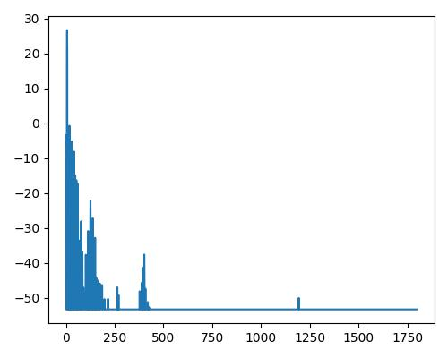

| Condition value | 0   | 0.25 | 0.5 | 0.75 | 1.0 |
| --------------- | --- | ---- | --- | ---- | --- |
| 明るさ(bright)  |     |      |     |      |     |
|                 |  |   |   |   |   |
|                 |     |      |     |      |     |
| リッチさ(rich)  |     |      |     |      |     |
|                 |  |  |  |  |  |
|                 |     |      |     |      |     |
| 温かさ(warm)    |     |      |     |      |     |
|                 |  |  |  |  |  |
|                 |     |      |     |      |     |

| Condition value | 0   | 0.25 | 0.5 | 0.75 | 1.0 |
| --------------- | --- | ---- | --- | ---- | --- |
| 明るさ(bright)  |     |      |     |      |     |
|                 |  |   |   |   |   |
|                 |     |      |     |      |     |
| リッチさ(rich)  |     |      |     |      |     |
|                 |  |  |  |  |  |
|                 |     |      |     |      |     |
| 温かさ(warm)    |     |      |     |      |     |
|                 |  |  |  |  |  |
|                 |     |      |     |      |     |

| Condition value | 0   | 0.25 | 0.5 | 0.75 | 1.0 |
| --------------- | --- | ---- | --- | ---- | --- |
| 明るさ(bright)  |     |      |     |      |     |
|                 |  |   |   |   |   |
|                 |     |      |     |      |     |
| リッチさ(rich)  |     |      |     |      |     |
|                 |  |  |  |  |  |
|                 |     |      |     |      |     |
| 温かさ(warm)    |     |      |     |      |     |
|                 |  |  |  |  |  |
|                 |     |      |     |      |     |